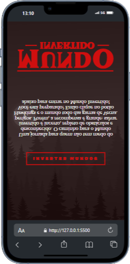

# Mundo Invertido
 Esta página foi desenvolvida para oferecer uma experiência única com **formulários de inscrição**, **temas dinâmicos com música**, e um design **totalmente responsivo para dispositivos móveis**.

---

## ✨ Funcionalidades

- **Formulário de Inscrição**: Uma interface simples e funcional para capturar dados dos usuários.
- **Temas Dinâmicos**: Alteração de cores, estilos e músicas que se ajustam ao tema escolhido pelo visitante.
- **Responsividade Mobile**: Layout otimizado para dispositivos móveis e tablets, garantindo acessibilidade em qualquer tela.
- **Interatividade Musical**: Música de fundo sincronizada com o tema escolhido.
- **Design Atraente**: Um visual moderno, inspirado em universos fictícios.

---

## 📸 Demonstração

.png)

---

## 🚀 Como Usar

1. Acesse a página inicial e escolha um tema dinâmico.
2. Preencha o formulário de inscrição com seus dados.
3. Explore os temas musicais e as mudanças visuais enquanto navega.

---

## 🛠️ Tecnologias Utilizadas

- **HTML5**: Estruturação do conteúdo.
- **CSS3**: Estilização, responsividade e animações.
- **JavaScript**: Funcionalidades dinâmicas, temas e interatividade.

---

